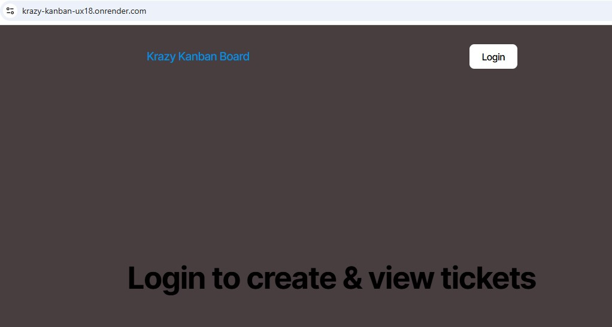
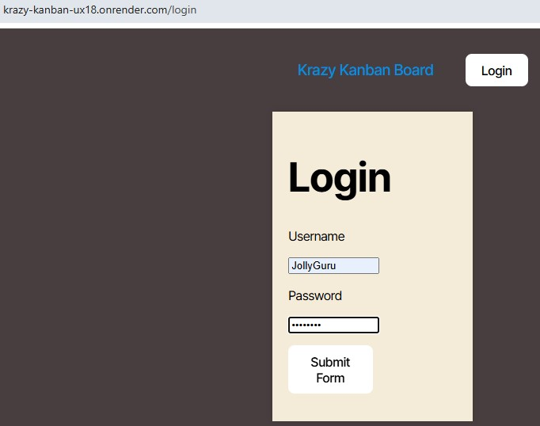
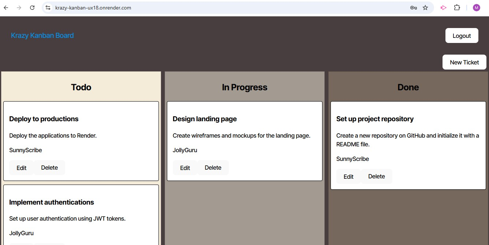
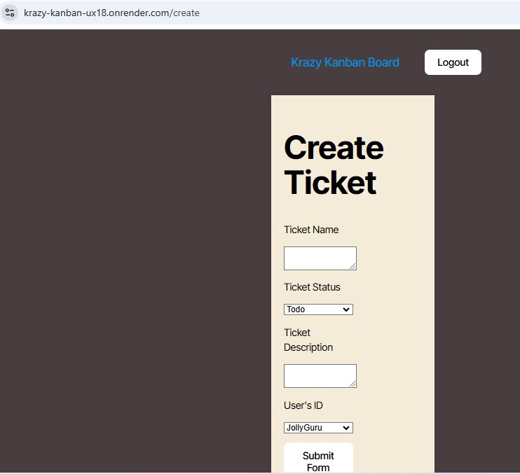
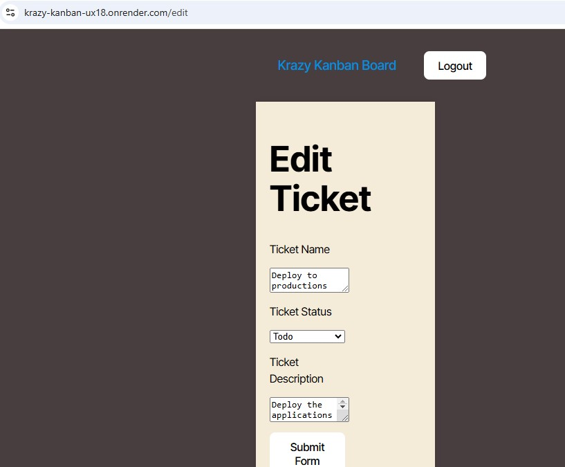

# Krazy Kanban
   

   ## Description

   This is a Kanban board application integrated with Postgres server along with JWT authentication to keep track the different tickets entered by the users.

   ## Table of Contents

   - [Installation](#installation)
   - [Technologies](#Technologies)
   - [Usage](#usage)
   - [Challenges](#challenges)
   - [Tests](#tests)
   - [Future Implementation](#Future-Implementation)
   - [Contributing](#Contributing)
   - [Questions](#questions)
   - [License](#license)

   ## Installation
   The best way to install this Front end React application using Postgres SQL Server is to use Render which easily integrates with Github!Render provides logs and statistics as well.

   ## Technologies
   React,Postgres,JWT,CSS,node,npm

   ## Usage
   Please launch the website deployed in render using this link - https://krazy-kanban-ux18.onrender.com/
   You would be landed in the home page with a login option. Click the login button where you will be directed to a login page. Please enter one of the credentials provided in the database Seed file and click Submit Form. You should land on the Kanban dashboard page where you can see all the different tickets entered by various users. From the dashboard, you have the option to either edit or delete a ticket right below the ticket descriptions. Besides these options, you can also click the New ticket button to enter a new ticket for the Kanban board. If you are done using the system, please click logout to return to the login page. If you are trying to access any of the child pages without logging in first, you will be directed to the login page since the JWT token hasn't been generated and the user needs to have a valid signed token in order to use the child pages like new / edit ticket entry. The below screen shots helps you visualize the workflow / functionality

   
   **Screenshots**:

   **Home Page**

   

   **Login Page**

   

   **Dashboard Page**

   

   **New Ticket Entry Page**

   

   **Edit Ticket Entry Page**
   
   
   
   
   ## Challenges
   During the project, I had issues with render configurations for the build and deployment process. Otherwise, overall the JWT concept has been implemented well 
   

   ## Tests
   Ensure the app opens and ensure you are able to navigate into each of the pages as detailed in the usage. You may refer to the above screenshots too.

   ## Future Implementation
   Add extra features to implement sorting and filtering capabilities to the dashboard.

   ## Contributing
   Please review the future ideas options and try to contribute or if you find any issues during your testing, please contact me to report issues

   ## Questions
   Please check my GitHub Profile (https://github.com/https://github.com/Mahesh-GH24)  
   Please contact me at MaheshGunasekaran24@gmail.com

   ## License
   Apache License v2.0